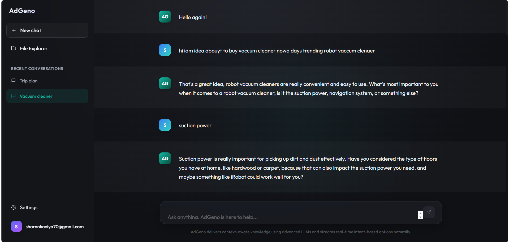
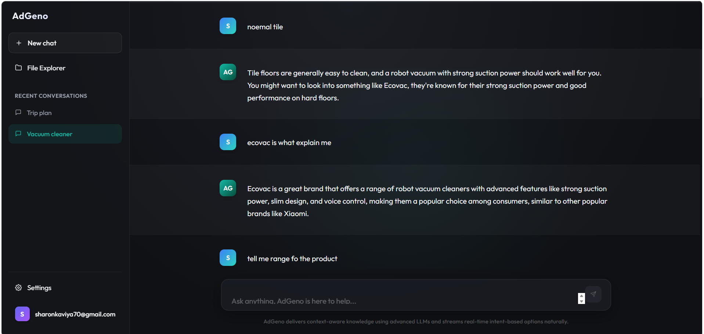
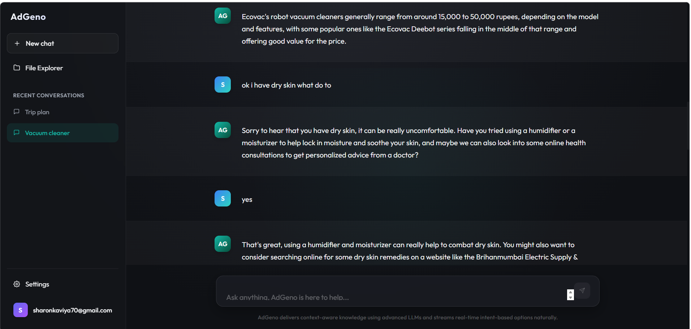

# AdGeno 🤖💼

AdGeno is an intelligent, context-aware chatbot platform that seamlessly integrates stealth advertising into natural, empathetic conversations. Built with a modern tech stack, it provides a seamless user experience while dynamically fetching real-time recommendations based on the user's implicit intent.

## 📸 Screenshots




## 🌟 Key Features
- **Empathetic AI Conversationalist**: Acts as a supportive friend, offering concise and engaging responses.
- **Stealth Ad Injection**: Natively weaves product recommendations into the conversation without feeling intrusive or "salesy".
- **Dynamic Live Web Search**: Utilizes `duckduckgo-search` to find real-time, relevant product links when local database options are insufficient.
- **User-Centric Trust Flow**: Only provides external links when explicitly requested by the user, ensuring a high-trust interaction model.
- **Glassmorphism UI**: A sleek, modern frontend design crafted with React and Vite.

## 🛠️ Tech Stack
- **Frontend**: React.js, Vite, Vanilla CSS (Glassmorphism design)
- **Backend**: FastAPI, Python 3, SQLAlchemy, SQLite (Development)
- **AI/LLM Engine**: Groq API (LLaMA 3 models)
- **Live Search Integration**: DuckDuckGo API wrapper

---

## 🚀 Getting Started

### Prerequisites
- Node.js (v16+)
- Python 3.10+
- A Groq API Key

### Backend Setup
1. Navigate to the `backend` directory:
   ```bash
   cd backend
   ```
2. Create and activate a virtual environment:
   ```bash
   python -m venv venv
   # On Windows:
   .\venv\Scripts\activate
   # On macOS/Linux:
   source venv/bin/activate
   ```
3. Install dependencies:
   ```bash
   pip install -r requirements.txt
   ```
4. Create a `.env` file in the `backend` directory and add your Groq API Key:
   ```env
   GROQ_API_KEY=your_api_key_here
   ```
5. Start the FastAPI server:
   ```bash
   python -m uvicorn app.main:app --reload
   ```

### Frontend Setup
1. Navigate to the `frontend` directory:
   ```bash
   cd frontend
   ```
2. Install dependencies:
   ```bash
   npm install
   ```
3. Start the development server:
   ```bash
   npm run dev
   ```
4. Open your browser and navigate to `http://localhost:5173`.

---

## 💡 How It Works
1. The user sends a message.
2. The backend analyzes the text and detects the core intent using an LLM.
3. If the intent matches a specific category, it queries the local database. If not, it executes a live web search.
4. The retrieved product details are injected as a hidden system prompt into the conversational AI model.
5. The AI responds naturally, weaving in the recommendation textually. It withholds the URL until the user explicitly requests it.

## 📝 License
This project is licensed under the MIT License.
